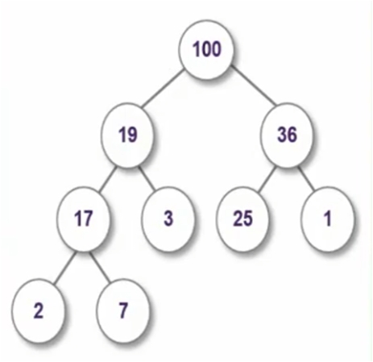

#### heap의 개념

- heap은 우선 순위 큐(Priority Queue)의 일종으로 우선 순위가 높은 요소를 효율적으로 선택할 수 있는 자료구조이다.
- heap은 주로 tree구조로 구현하며 나무 구조에서 부모의 키 값을 두 자식의 키 값보다 크게 만들어 주면 된다.
- 즉, heap의 뿌리(root)는 전체 데이터 중에서 가장 우선 순위가 높은 자료이고 뿌리의 자식은 뿌리 보다 작은 두개의 자료로 구성하면 된다.

{: width="50%" height="50%"}

#### 코드 구현

- 재귀함수를 사용하여 구현

~~~c
/*----------------------------------------------------------------------
함수명 및 기능 : quickSort() - 퀵 정렬 함수
전달인자: ary - 정렬할 데이터 배열의 시작주소
size - 소트할 데이터의 개수
리턴값: 없음
--------------------------------------------------------------------*/
void quickSort(int *ary, int size)
{
	int pivot, temp;
	int i, j;

	if(size<=1) return; // 구간값이 1이하이면 sort가 완료된 것 이므로 return

	pivot = ary[size-1];

	// TODO
	i=-1;
	j=size-1;

	while(1){
		while(ary[++i] < pivot);
		while(--j>=0 && ary[j] > pivot);
		if(i >=j)
			break;
		temp = ary[i];
		ary[i]=ary[j];
		ary[j]=temp;
	}
	temp=ary[i];
	ary[i]=ary[size-1];
	ary[size-1]=temp;
	quickSort(ary, i);// 좌측 소구간에 대한 퀵 정렬 재귀 호출
	quickSort(ary+i+1, size-i-1); // 우측 소구간에 대한 퀵 정렬 재귀 호출
}

~~~
